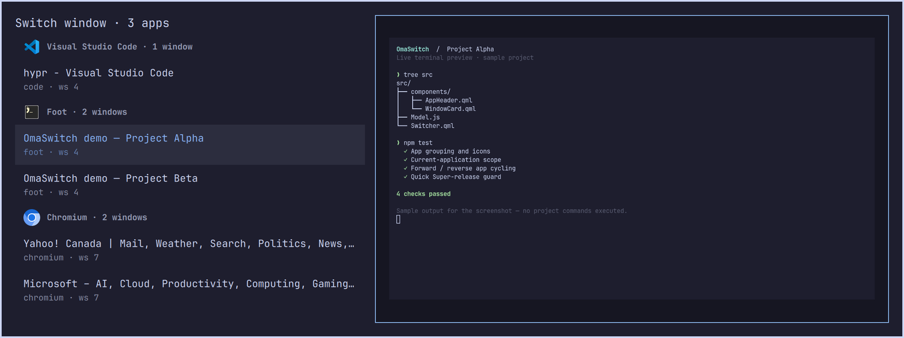
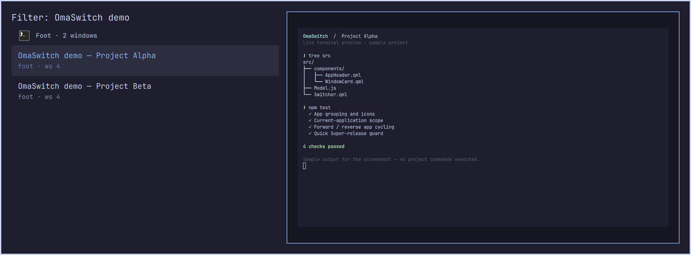
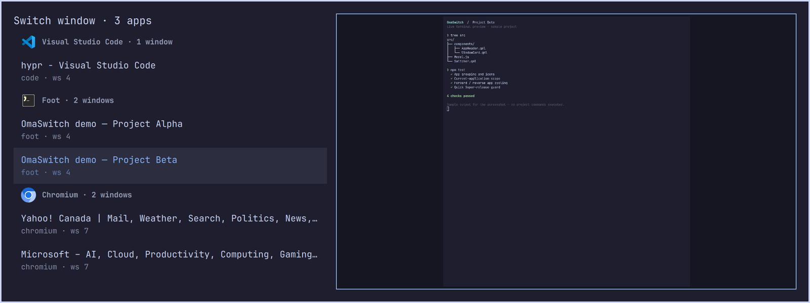

# OmaSwitch

**A familiar `Alt+Tab` switcher for Omarchy—with live window previews.**

OmaSwitch puts your recently used windows in one fast, keyboard-first overlay. Cycle through them with `Alt+Tab`, type to find one by name, and see a live preview of the highlighted window before you switch.



## Why you will like it

- **Recent windows first.** Uses Hyprland focus history, so the window you want is usually next.
- **Grouped by app.** Each app has a heading, icon, and matching-window count. Groups and their windows follow recent-use order; quick switching still selects the previous window globally.
- **Cycle within an app.** Backtick/Shift+backtick wrap within the highlighted app without leaving the full list. Super+backtick can open only the current app's windows.
- **Preview before switching.** A live preview follows the selected row instead of showing stale screenshots.
- **Made for the keyboard.** Repeat `Alt+Tab`, search by typing, use arrows or Tab, then press Enter.
- **Stays light.** Only the highlighted window gets a capture stream—never every row.
- **Fits Omarchy.** Follows your active Omarchy theme and needs no daemon, packages, or privileges.

## See it in action

### Pick the project window without leaving the keyboard

Search by title, app, or workspace. Matching windows stay grouped with an app icon and updated window count, alongside the selected window's live preview.



### Cycle within an app without leaving the full list

Backtick and Shift+backtick cycle only within the highlighted app. Here Project Beta is selected in the Foot group while the other apps remain visible; Tab and arrows still navigate the full list.



Screenshots show the current grouped UI with sample terminal output and are cropped to the dialog; the terminal commands shown are demonstration text, not executed project commands.

## Add it to Omarchy

```bash
omarchy plugin add https://github.com/saboursepideh/omaswitch.git --enable
```

It installs in your user configuration and needs no extra package, service, or configuration file.

> Live previews require Hyprland's `hyprland-toplevel-export-v1` protocol. If it is unavailable, switching and search still work; the plugin simply uses its list-only layout.

## Make it your Alt+Tab switcher

Omarchy binds `Alt+Tab` to direct cycling by default. Add this to `~/.config/hypr/bindings.lua` to replace those two bindings:

```lua
hl.unbind("ALT + TAB")
hl.unbind("ALT + SHIFT + TAB")

o.bind("ALT + TAB", "OmaSwitch", "omarchy-shell shell summon piyush.omaswitch '{\"mode\":\"cycle\",\"direction\":1}'")
o.bind("ALT + SHIFT + TAB", "OmaSwitch (reverse)", "omarchy-shell shell summon piyush.omaswitch '{\"mode\":\"cycle\",\"direction\":-1}'")
```

Then reload Hyprland:

```bash
hyprctl reload
hyprctl configerrors
```

`configerrors` should print no errors. If you want to keep Omarchy's default bindings, bind either summon command to another key instead.

## Familiar from the first keypress

| Shortcut | What it does |
| --- | --- |
| `Alt+Tab` | Open the switcher and move to the next recent window |
| `Alt+Shift+Tab` | Open the switcher and move backward |
| `Tab`, `Down`, `Right` | Select the next window |
| `Shift+Tab`, `Up`, `Left` | Select the previous window |
| `` ` `` / `~` | Select the next / previous visible window of the highlighted app, wrapping within its group (never entered in the filter) |
| Type | Filter by title, application, or workspace |
| `Backspace` / `Ctrl+Backspace` | Delete a character / word from the search |
| `Ctrl+U` | Clear the search |
| `Enter` or click | Focus the selected window |
| `Esc` or click outside | Close without switching |

To open the searchable picker directly:

```bash
omarchy-shell shell toggle piyush.omaswitch
```

### Low-latency Hyprland Lua bindings

OmaSwitch registers native global shortcut targets so Hyprland can open the
already-loaded overlay without starting `omarchy-shell` and `qs` on every
keypress:

```lua
hl.unbind("SUPER + TAB")
hl.unbind("SUPER + SHIFT + TAB")
hl.unbind("SUPER + GRAVE")
hl.unbind("SUPER + SHIFT + GRAVE")
o.bind("SUPER + TAB", "OmaSwitch", hl.dsp.global("omaswitch:next"))
o.bind("SUPER + SHIFT + TAB", "OmaSwitch (reverse)", hl.dsp.global("omaswitch:previous"))
o.bind("SUPER + GRAVE", "OmaSwitch current app", hl.dsp.global("omaswitch:current-next"))
o.bind("SUPER + SHIFT + GRAVE", "OmaSwitch current app (reverse)", hl.dsp.global("omaswitch:current-previous"))
```

The native targets handle the initial keypress only. Once the overlay has
exclusive keyboard focus, its QML key handler handles continued cycling and
modifier release.

### Recommended: reliable quick Super release

Very quick gestures can release Super before the overlay receives keyboard
focus. Use the included native Hyprland helper **instead of** the four direct
bindings above to catch this race:

```lua
local omaswitch_cycle = dofile(os.getenv("HOME") .. "/.config/omarchy/plugins/piyush.omaswitch/hypr/omaswitch-cycle.lua")
hl.unbind("SUPER + TAB")
hl.unbind("SUPER + SHIFT + TAB")
hl.unbind("SUPER + GRAVE")
hl.unbind("SUPER + SHIFT + GRAVE")
o.bind("SUPER + TAB", "OmaSwitch", omaswitch_cycle("next"))
o.bind("SUPER + SHIFT + TAB", "OmaSwitch (reverse)", omaswitch_cycle("previous"))
o.bind("SUPER + GRAVE", "OmaSwitch current app", omaswitch_cycle("current-next"))
o.bind("SUPER + SHIFT + GRAVE", "OmaSwitch current app (reverse)", omaswitch_cycle("current-previous"))
```

This requires Hyprland's Lua `hl.timer()` and `hl.is_key_down()` APIs. A 16 ms
timer runs only during a gesture and sends `omaswitch:commit` when both Super
keys are up. Releasing Tab/backtick alone does not commit. It uses no shell
processes, release bindings, or privileged input access; shortcut inhibition
cannot conceal the compositor's key state. This helper is for **Super**
bindings, not Alt bindings.

The current app is captured before the overlay takes focus, so focus loss
cannot change the app filter. In the full list, backtick cycles the highlighted
app while Tab/arrows retain full-list navigation. Search groups only matching
windows and refreshes preserve the selected window when it still exists.

To cycle only windows belonging to the currently focused application:

```bash
omarchy-shell shell summon piyush.omaswitch '{"mode":"cycle","direction":1,"scope":"current-app"}'
```

## Keep it current

```bash
omarchy plugin update piyush.omaswitch --yes
```

To disable or remove it:

```bash
omarchy plugin disable piyush.omaswitch
omarchy plugin remove piyush.omaswitch --yes
```

## Troubleshooting

**Updated shortcuts or UI changes do not appear**

Some shell versions retain cached plugin components after a reported hot
reload. Run `omarchy restart shell`, then check `hyprctl globalshortcuts` for
`omaswitch:commit`. After changing Hyprland bindings, also run `hyprctl reload`
and `hyprctl configerrors`.

**The plugin is not listed**

```bash
omarchy-shell shell rescanPlugins
omarchy plugin list --json
```

**Alt+Tab still directly cycles windows**

Confirm that the original bindings were unbound, then run:

```bash
hyprctl reload
hyprctl configerrors
omarchy menu keybindings --print | grep -E 'ALT \+ TAB|SHIFT ALT \+ TAB|OmaSwitch'
```

**The plugin opens without a preview**

The selected window may not be capturable, or `hyprland-toplevel-export-v1` may be unavailable. This is expected fallback behavior; the list remains fully usable.

**The plugin reports a QML error**

```bash
journalctl --user -f | grep -Ei 'piyush.omaswitch|Switcher.qml|qml.*(error|warning)'
```

## Development

```bash
node test_model.js
lua test_release_guard.lua
omarchy plugin validate .
git diff --check
```

The plugin is MIT licensed; see [LICENSE](LICENSE). It is an independent community plugin and is not affiliated with Omarchy.
